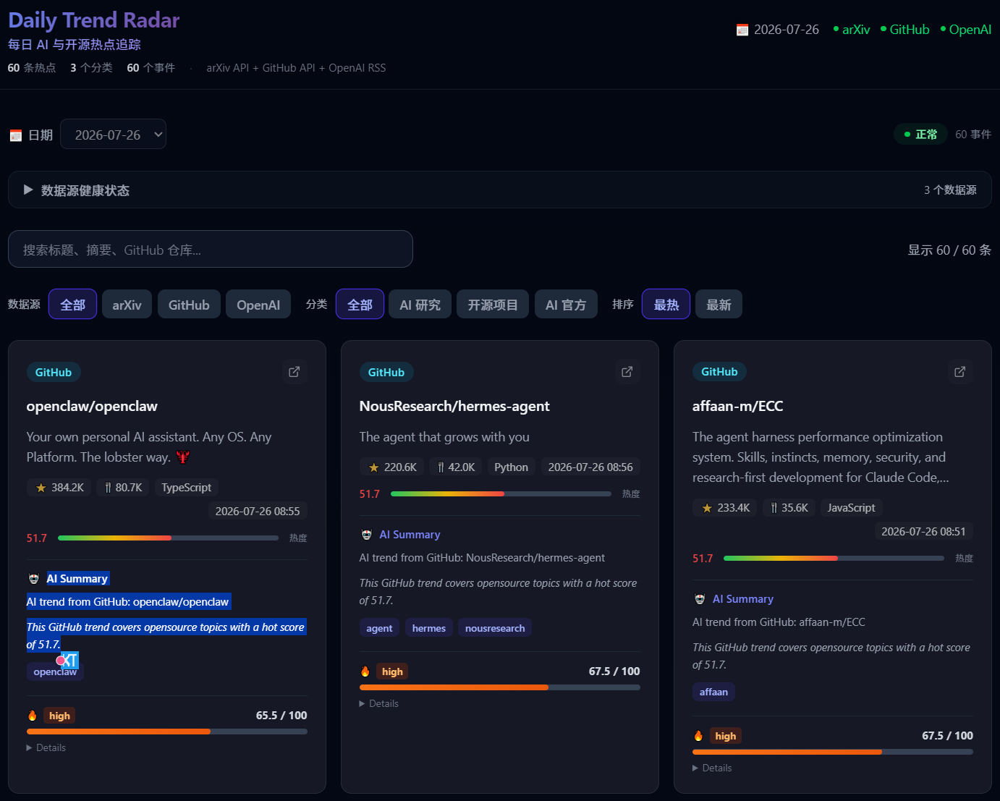

# Daily Trend Radar

每日 AI 与开源热点雷达

> 基于 Python Pipeline + Next.js 的每日热点自动聚合平台。已实现从数据采集、评分排序、趋势分析到 Dashboard 展示的全链路自动化闭环。


---

## 数据原则

- **真实存在** — 所有热点必须真实存在，严禁虚构新闻、标题、来源或热度。
- **原始来源** — 每条信息提供可追溯的 `original_url`，可点击查看原文。
- **不足不凑数** — 每板块最多 20 条；数据不足时宁少勿凑。
- **合法合规** — 遵守 `robots.txt`、API 条款与频率限制。

---

## Screenshot



---

## 当前状态

> ✅ **MVP 核心闭环已完成，实现每日自动运行。**

当前已实现：
- **3 个数据源**自动采集（arXiv / GitHub / OpenAI Blog），每日最多产出 60 条 Trend
- **14 阶段 Pipeline**（采集 → 标准化 → 校验 → 去重 → Event 聚合 → 评分 → 排序 → 发布）
- **Trend Intelligence**：Hot Score + Trend Score + Impact Level + AI Summary
- **Event Intelligence**：跨源 Event 聚合 + 稳定 event_id + Trend↔Event 双向关联
- **Historical Intelligence**：跨日期趋势匹配 + Score/Rank Change + Sparkline + Days Present
- **Next.js Dashboard**：搜索、筛选、排序、日期导航、历史趋势、健康状态
- **GitHub Actions** 每日 02:00 UTC 自动运行 Pipeline，数据同步提交后触发 Vercel 部署

> **注意**：项目当前处于数据积累初期（2 天真实数据），部分历史趋势功能（如多日热点 ≥3 天）需更多数据后才能自然体现。跨源 Event 聚合能力已就绪，但当前数据中多源事件数量为零，有待进一步积累。

---

## Technical Highlights

### Pipeline — 14 阶段数据处理链路

```
Adapter Fetch → Normalize → Validate → Source Verify → Dedup
→ Cross-source Cluster → Hot Score → Rank → Cap (≤20)
→ AI Summary → Trend Score → Publish (双重 Schema 验证)
```

- **Adapter Registry**：统一注册表，仅实例化已启用的数据源
- **Local-first 数据架构**：按 `data/YYYY/MM/YYYY-MM-DD.json` 日期分片，无需云端后端
- **双重 Schema 验证**：Pydantic 模型验证 + JSON Schema，写入前检查
- **Health Monitoring**：每次运行记录 `health.json` / `sources_state.json`

### Trend Intelligence

- **Hot Score** — 5 维透明评分（Authority / Heat / Freshness / MultiSource / Platform），0–100
- **Trend Score** — 规则合成评分（Source 30 + Hot 30 + Freshness 20 + AI Relevance 20）
- **Impact Level** — critical / high / medium / low
- **Score Reason** — 每项评分的透明原因说明
- **AI Summary** — Top-10 最热 Trend 生成摘要（关键词 / 影响说明）；无 API Key 时自动使用模板回退，不阻断 Pipeline

### Event Intelligence

- **Event Schema** — Pydantic + JSON Schema + TypeScript 三层一致
- **稳定 event_id** — 基于实体的语义哈希，跨日期、跨源稳定
- **Trend ↔ Event 双向关联** — `trend.event_id` ↔ `event.trend_ids`
- **保守跨源聚合** — 同实体 + 时间窗口 + 关键词重叠才合并，宁可少聚不要错聚

> 当前数据中多源 Event 数量为 0；跨源聚合能力有待更多数据积累后自然体现。

### Historical Intelligence

- **跨日期 Trend ID 稳定匹配** — 基于 `sha256(source_id + canonical_url)` 的唯一 ID
- **Score Change** — 与前一日趋势分数的变化值
- **Rank Change** — 与前一日排名的上升/下降（↑N / ↓N）
- **Sparkline** — 内联 SVG 迷你折线图，无外部依赖
- **Days Present** — 该趋势在历史中出现的天数
- **First Seen** — 该趋势首次出现的日期
- **非连续日期比较** — 跳过中间缺失日期，直接比较最近两次出现

> 当前仅有 2 天真实数据，长期趋势分析能力处于数据积累阶段。

---

## 数据源

| Source | 类型 | 每日最多 | 状态 |
|--------|------|---------|------|
| arXiv Atom API | API | 20 条 | ✅ 已启用 |
| GitHub Search API | API | 20 条 | ✅ 已启用 |
| OpenAI Blog RSS | RSS | 20 条 | ✅ 已启用 |

**每日最大产出**：3 源 × 最多 20 条 = **最多 60 条 Trend**

---

## 已实现能力

### 7.1 Pipeline

- 14 阶段数据处理链路，配置驱动，支持跨源
- arXiv Adapter：官方 Atom API，遵守 3s 间隔
- GitHub Adapter：官方 Search Repositories API，含 stars/forks/language 等 metadata
- RSS Adapter：通用 RSS/Atom 解析
- 双重 Schema 验证（Pydantic + jsonschema），拒绝无效数据
- Pipeline CLI：`--source`、`--dry-run`、`--date`、`--config`、`--data-dir`

### 7.2 Trend Intelligence

- Hot Score 5 维透明评分 + 权重可配置
- Trend Score 规则评分（Source + Hot + Freshness + AI Relevance）
- Impact Level 四级分类（critical / high / medium / low）
- Score Reason 逐项原因说明
- AI Summary：Top-10 热点摘要，无 API Key 时模板回退

### 7.3 Event Intelligence

- Event Schema 三层一致
- 稳定 event_id（基于实体语义哈希）
- Trend ↔ Event 双向关联
- 保守跨源 Event 聚合（同源不同 URL 不聚合）

### 7.4 Historical Intelligence

- 跨日期 Trend ID 稳定匹配
- Score Change + Trend Direction
- Rank Change（↑N / ↓N）
- 内联 SVG Sparkline
- Days Present + First Seen
- 非连续日期历史比较

### 7.5 Frontend Dashboard

- 数据源筛选（全部 / arXiv / GitHub / OpenAI）
- 分类筛选（全部 / AI 研究 / 开源项目 / AI 官方）
- 关键词搜索（标题 / 摘要 / GitHub 仓库名）
- 排序（最热 / 最新）
- 日期选择（Dropdown + URL searchParams `?date=YYYY-MM-DD`）
- 健康状态面板（可折叠，每源状态 + 更新时间）
- Hot Score 进度条
- Trend Score 条形图 + Impact Level 彩色徽章
- Score Reason 可折叠详情
- AI Summary 展示（summary + why_it_matters + keywords）
- Trend History（方向 + 分数变化 + Sparkline）
- Rank Change（↑N / ↓N）
- Days Present
- Event 统计数字
- 响应式布局（一列 / 两列 / 三列）

### 7.6 Automated Data Production

- GitHub Actions：每日 02:00 UTC 定时触发（北京时间 10:00）
- 支持 `workflow_dispatch` 手动触发
- 自动安装依赖 → 运行测试 → 执行 Pipeline → 验证输出
- 自动同步 `data/` → `frontend/public/data/`
- 自动 Git 提交（仅数据有变化时提交，`[skip ci]` 防循环）
- 自动 Push 到 master 分支
- 历史成功运行记录（见 `git log` 中 `github-actions[bot]` 提交记录）

---

## 自动化数据生产链路

```
GitHub Actions Cron (每日 02:00 UTC)
    ↓
Pipeline (Adapter → Normalize → Validate → ... → Publish)
    ↓
Schema 双重验证
    ↓
同步 data/ → frontend/public/data/
    ↓
Git Commit + Push (仅数据有变化时)
    ↓
Vercel 自动部署（依赖 Vercel Dashboard 云端项目配置）
```

> **说明**：GitHub Actions 每日定时执行 Pipeline 并推送数据更新。Vercel 检测到 master 分支有新的 push 后可自动触发重新部署，是否启用此功能取决于用户在 Vercel Dashboard 中的项目配置。

---

## 技术栈

| 层 | 选型 |
|---|---|
| 前端框架 | Next.js 15 (App Router) |
| UI | React 19 + TypeScript 5.7 |
| 样式 | Tailwind CSS 4 |
| 采集/处理 | Python ≥3.12 |
| 数据模型 | Pydantic ≥2.7 |
| Schema 验证 | jsonschema ≥4.21 |
| 配置 | PyYAML ≥6.0 |
| 测试（Python） | pytest ≥8（约 243 项） |
| 测试（前端） | Node.js 内置 node:test（约 37 项） |
| 数据存储 | 本地 JSON 文件（日期分片） |
| CI/CD | GitHub Actions |
| 部署 | Vercel |
| Linter | Ruff |

---

## 项目目录

```
daily-trend-radar/
├── .github/workflows/      # GitHub Actions 自动 Pipeline
├── config/                 # 数据源配置 (sources.yaml)
├── data/                   # Pipeline 产出数据（仅本机，不入仓）
├── docs/                   # 架构 / 设计文档 + 截图
├── frontend/               # Next.js 前端
│   ├── app/                # 页面 + 组件
│   ├── lib/                # 数据仓储 + 类型 + 趋势计算
│   └── public/data/        # Git 跟踪的同步数据（Vercel 部署使用）
├── pipeline/               # Python 采集 Pipeline
│   └── src/pipeline/
│       ├── adapters/       # 数据源适配器（arxiv / github / rss）
│       ├── core/           # 配置加载
│       └── ...             # Pipeline 编排 / 评分 / 发布 / 校验
├── schemas/                # JSON Schema 契约
├── tests/                  # Python 测试
├── .env.example
├── .gitignore
├── PROJECT_RULES.md
├── LICENSE
└── README.md
```

---

## 本地运行

### Pipeline

```bash
cd pipeline
pip install -e ".[dev]"

# 运行全部已启用的数据源
PYTHONPATH=src python -m pipeline

# 单源运行
PYTHONPATH=src python -m pipeline --source arxiv

# 试运行（不写入文件）
PYTHONPATH=src python -m pipeline --dry-run

# 指定日期
PYTHONPATH=src python -m pipeline --date 2026-07-26

# 查看帮助
PYTHONPATH=src python -m pipeline --help
```

### Frontend

```bash
cd frontend
npm install

# 开发模式
npm run dev           # http://localhost:3000

# 生产构建
npm run build

# TypeScript 类型检查
npm run typecheck

# Repository 测试（11 项）
npm test
```

---

## 测试

| 类型 | 数量 | 运行方式 |
|------|------|---------|
| Python Pipeline 测试 | 约 243 项 | `cd pipeline && pytest` |
| 前端 Repository 测试 | 11 项 | `cd frontend && npm test` |
| 前端 Trend Utils 测试 | 26 项 | `cd frontend && node --experimental-strip-types --test lib/__tests__/trend-utils.test.ts` |

> npm test 当前只覆盖 Repository 测试；Trend Utils 测试需使用上述单独命令运行。合计约 37 项前端测试。

---

## Roadmap

### ✅ 已完成

- **3 个数据源**：arXiv / GitHub / OpenAI Blog，每源最多 20 条/日
- **Pipeline 14 阶段闭环**：采集 → 标准化 → 校验 → 去重 → Event 聚合 → Hot Score → 排序 → 封顶 → AI Summary → Trend Score → 发布
- **Hot Score**：5 维透明评分系统
- **Trend Score**：规则合成评分 + Impact Level + Score Reason
- **AI Summary**：Top-10 热点摘要能力，无 API Key 时模板回退；Pipeline 当前 AI Processor 为 NullAIProcessor
- **Event Intelligence**：跨源 Event 聚合、稳定 event_id、Trend↔Event 关联
- **Historical Intelligence**：Score Change、Rank Change、Sparkline、Days Present、First Seen、非连续日期比较
- **Next.js Dashboard**：搜索、筛选、排序、日期浏览、历史趋势、健康状态
- **GitHub Actions 自动每日运行**（02:00 UTC）+ 数据同步 + Git 提交 + Push
- **Vercel 部署链路**（需确认 Dashboard 云端配置）
- 约 243 项 Python 测试 + 37 项前端测试

### 🔮 未来规划

- **数据积累** — 运行 7–14 天后，历史趋势能力（多日热点、趋势生命周期）将发挥更大价值
- **跨源 Event 聚合** — 随着多日数据积累，跨源 Event 将自然出现，届时可考虑增强 Event 可视化
- **更多数据源** — 接入经合规评估的新数据源
- **AI Summary 升级** — 启用真实 LLM API 后进一步提升摘要质量
- **前端主题切换** — 增加用户可操作的主题切换按钮

---

## License

本项目采用 **MIT License**（见 `LICENSE`）。
